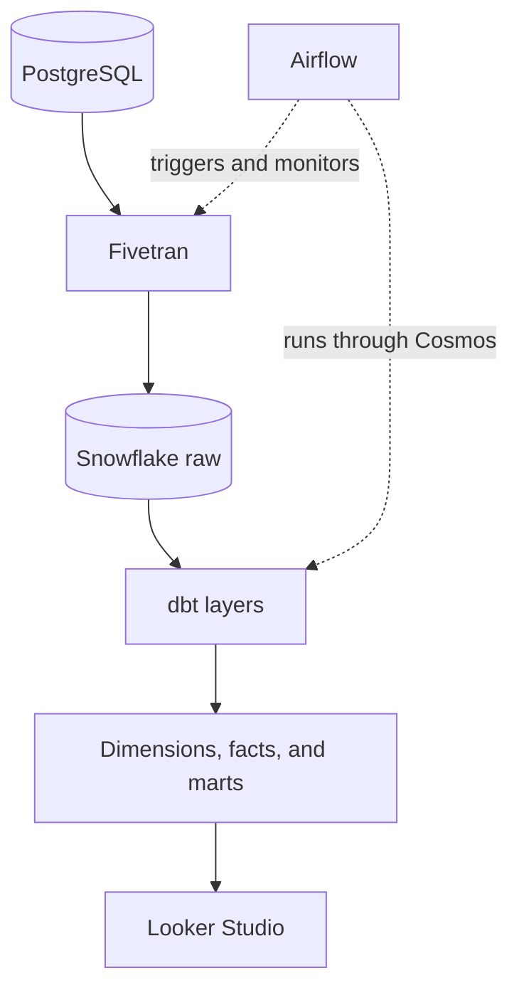
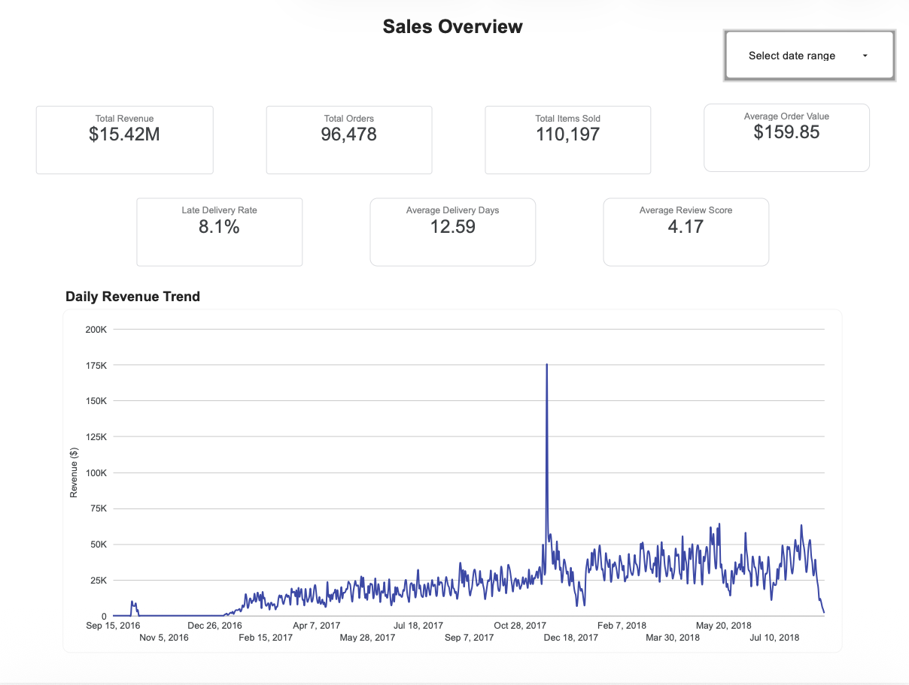
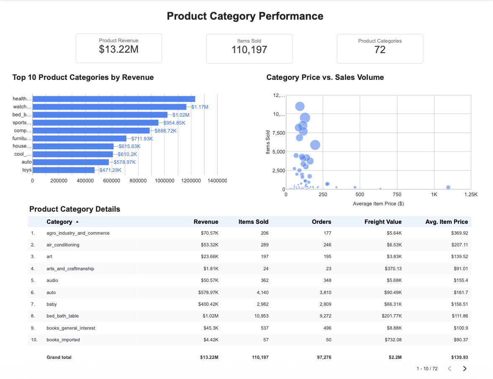
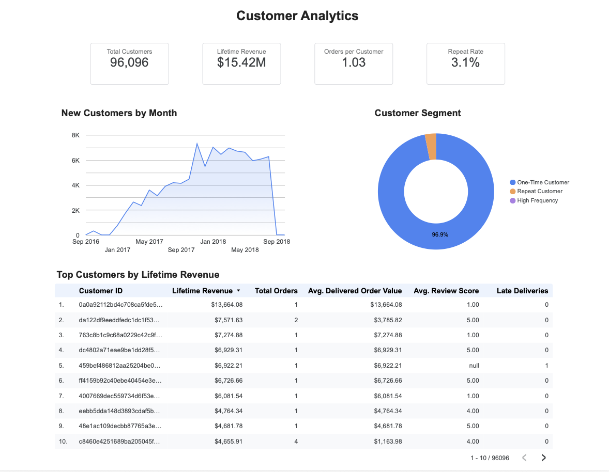

# Olist E-Commerce Sales Analytics Platform

An end-to-end ELT platform that transforms the Olist Brazilian e-commerce
dataset into tested Snowflake analytics marts and an interactive Looker Studio
dashboard.

**Stack:** PostgreSQL → Fivetran → Snowflake → dbt → Airflow + Cosmos →
Looker Studio, with Docker for reproducible local execution.

## Project goal

The project demonstrates how an analytics-engineering team can ingest,
transform, test, orchestrate, and serve e-commerce data through a production-style
batch pipeline rather than a one-off notebook.

The source is the
[Brazilian E-Commerce Public Dataset by Olist](https://www.kaggle.com/datasets/olistbr/brazilian-ecommerce),
containing 1,550,922 records across nine source tables for customers, orders,
items, products, sellers, payments, reviews, geolocation, and category
translations.

## Architecture



1. **Source:** The Olist tables are loaded into PostgreSQL. Neon hosts the
   external source used by Fivetran, while Docker Compose provides a local
   PostgreSQL instance for development.
2. **Extract and load:** Fivetran incrementally replicates the PostgreSQL
   source into a raw Snowflake schema.
3. **Transform:** dbt builds staging, intermediate, dimension, fact, and
   reporting-mart models in Snowflake.
4. **Orchestrate:** Airflow triggers and monitors an existing Fivetran
   connection. After ingestion succeeds, Astronomer Cosmos renders dbt models
   and tests as individual Airflow tasks.
5. **Serve:** Looker Studio queries the Snowflake marts through a dedicated
   read-only role.

See [docs/architecture.md](docs/architecture.md) for implementation details,
failure handling, and the local-versus-managed-service topology.

For startup, validation, monitoring, and troubleshooting procedures, see the
[operations runbook](docs/operations-runbook.md).

## Data model

The dbt project contains 23 models:

- **9 staging models:** one per source table, with type normalization,
  trimming, renaming, and light cleanup.
- **6 intermediate models:** reusable payment, review, item, order, and product
  enrichments and aggregations.
- **8 marts:** three dimensions, two facts, and three reporting marts.

The marts layer includes:

- `dim_customers`
- `dim_products`
- `dim_sellers`
- `fct_orders`
- `fct_order_items`
- `mart_daily_sales`
- `mart_customer_summary`
- `mart_product_category_performance`

## Orchestration and reliability

The `olist_elt_pipeline` DAG:

1. Records the connector's previous Fivetran success and failure timestamps.
2. Requests an incremental sync and safely handles `409 AlreadyInSync`.
3. Polls every 15 seconds in `reschedule` mode, with a 30-minute timeout.
4. Stops the pipeline if the connector is paused or the current sync fails.
5. Runs dbt models and tests through a Cosmos `DbtTaskGroup` only after
   ingestion succeeds.

The final DAG contains 48 tasks: two Fivetran orchestration tasks and 46 dbt
model and test tasks.

## Data quality

Quality controls are applied at both the source and warehouse layers:

- PostgreSQL validation checks for orphaned records, invalid ranges, and
  negative monetary values.
- dbt schema tests enforce uniqueness, non-null constraints, accepted values,
  and referential integrity.
- A singular reconciliation test verifies that order-level payment totals in
  `fct_orders` agree with the underlying staging payment records.

The dbt project contains 110 tests after adding the payment reconciliation
check.

## Analytics dashboard

The
[interactive Looker Studio dashboard](https://datastudio.google.com/reporting/5748ab4b-ea3c-4a78-bd9b-3373faa4ef5e)
provides three reporting pages backed by Snowflake marts.

### Sales Overview

Tracks revenue, orders, items sold, average order value, delivery performance,
review scores, and revenue trends.



### Product Category Performance

Compares category revenue, sales volume, average price, freight value, and
price-versus-volume behavior.



### Customer Analytics

Analyzes customer acquisition, repeat-customer behavior, lifetime revenue,
customer segments, and high-value customers.



## Security

- Snowflake service users authenticate through RSA key pairs.
- Snowflake roles separate transformation and read-only dashboard access.
- Fivetran uses a dedicated read-only PostgreSQL user.
- Private keys are mounted read-only into containers.
- Passwords, API credentials, account identifiers, and private keys are kept
  outside Git through ignored environment files.

## Getting started

### Prerequisites

- Docker and Docker Compose
- A Snowflake account with the project database, schemas, roles, and warehouse
- An existing Fivetran PostgreSQL connection
- A Snowflake RSA key pair for the dbt service user

### Configuration

Clone the repository and create local configuration files from the safe
templates:

```bash
git clone https://github.com/FarnazNekuie/e-commerce-sales-analytics-elt-platform.git
cd e-commerce-sales-analytics-elt-platform

cp .env.example .env
cp .env.airflow.example .env.airflow
cp .env.dbt.example .env.dbt
cp .env.fivetran.example .env.fivetran
cp dbt/olist_analytics/profiles.yml.example \
  dbt/olist_analytics/profiles.yml
cp airflow/config/simple_auth_manager_passwords.json.example \
  airflow/config/simple_auth_manager_passwords.json
```

Replace every placeholder with your own configuration. Also replace the
placeholder password in
`airflow/config/simple_auth_manager_passwords.json`. Keep the resulting
`.env*`, `profiles.yml`, and Simple Auth Manager password file uncommitted.


Set `DBT_PRIVATE_KEY_HOST_PATH` in the root `.env` file to the absolute host
path of the dbt user's private key. Docker Compose mounts it read-only at
`/keys/dbt_private_key.p8` inside the Airflow containers.

### Local PostgreSQL source

Download the Olist CSV files into `data/raw/`, then start the local PostgreSQL
service:

```bash
docker compose up -d postgres
docker compose ps
```

The scripts under `postgres/init/` create and populate the source tables the
first time the database volume is initialized.

### Airflow orchestration

Build and start the Airflow services:

```bash
docker compose up -d --build
docker compose ps
```

Open `http://localhost:8080`, enable `olist_elt_pipeline`, and trigger it. The
DAG uses `schedule=None`, so it runs only when manually or externally
triggered.

Check DAG parsing and task generation:

```bash
docker compose exec airflow-scheduler \
  airflow dags list-import-errors

docker compose exec airflow-scheduler \
  airflow tasks list olist_elt_pipeline
```

### Run dbt from the Airflow container

```bash
docker compose exec airflow-scheduler \
  /opt/airflow/dbt_venv/bin/dbt build \
  --project-dir /opt/airflow/dbt/olist_analytics \
  --profiles-dir /opt/airflow/dbt/olist_analytics
```

## Repository structure

```text
├── airflow/                  # Airflow image, DAG, configuration, and plugins
├── data/raw/                 # Local source CSVs; contents ignored by Git
├── dbt/olist_analytics/      # dbt models, tests, profile example, and metadata
├── docs/                  # Architecture notes and operations runbook
├── postgres/
│   ├── init/                 # Local PostgreSQL schema and data loading
│   ├── neon/                 # Read-only Fivetran user configuration
│   └── validation/           # Source data-quality checks
├── screenshots/dashboard/   # Looker Studio dashboard screenshots
├── docker-compose.yml
└── README.md
```

## Validated results

- 1,550,922 records loaded across nine PostgreSQL source tables
- 23 dbt models across staging, intermediate, and marts layers
- 110 automated dbt tests
- 48 Airflow tasks generated without DAG import errors
- Successful Fivetran-to-dbt end-to-end execution in approximately 1 minute
  38 seconds during project validation
- Three Looker Studio dashboard pages backed by read-only Snowflake marts

## License

This project is licensed under the [MIT License](LICENSE).
